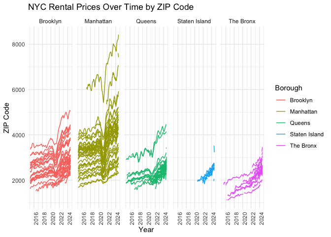
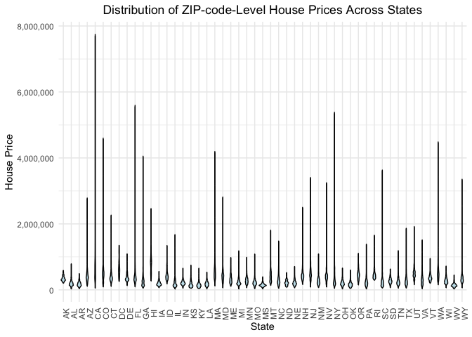
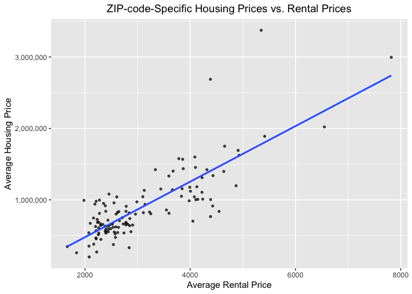

p8105_mtp_rw3033
================

# Problem 1

``` r
library(tidyverse)
```

    ## ── Attaching core tidyverse packages ──────────────────────── tidyverse 2.0.0 ──
    ## ✔ dplyr     1.1.4     ✔ readr     2.1.5
    ## ✔ forcats   1.0.0     ✔ stringr   1.5.1
    ## ✔ ggplot2   3.5.1     ✔ tibble    3.2.1
    ## ✔ lubridate 1.9.3     ✔ tidyr     1.3.1
    ## ✔ purrr     1.0.2     
    ## ── Conflicts ────────────────────────────────────────── tidyverse_conflicts() ──
    ## ✖ dplyr::filter() masks stats::filter()
    ## ✖ dplyr::lag()    masks stats::lag()
    ## ℹ Use the conflicted package (<http://conflicted.r-lib.org/>) to force all conflicts to become errors

``` r
library(rvest)
```

    ## 
    ## Attaching package: 'rvest'
    ## 
    ## The following object is masked from 'package:readr':
    ## 
    ##     guess_encoding

``` r
library(httr)

# Import Data
rental_df = read_csv("~/Desktop/BIST8105/HW/p8105_mpt_rw3033/Zip_zori_uc_sfrcondomfr_sm_month_NYC.csv",
  na = c("NA", ".", ""))|>
  janitor::clean_names()
```

    ## Rows: 149 Columns: 125
    ## ── Column specification ────────────────────────────────────────────────────────
    ## Delimiter: ","
    ## chr   (6): RegionType, StateName, State, City, Metro, CountyName
    ## dbl (119): RegionID, SizeRank, RegionName, 2015-01-31, 2015-02-28, 2015-03-3...
    ## 
    ## ℹ Use `spec()` to retrieve the full column specification for this data.
    ## ℹ Specify the column types or set `show_col_types = FALSE` to quiet this message.

``` r
url = "https://p8105.com/data/zip_codes.html"
zip_html = read_html(url)
```

``` r
library(dplyr)

zip_df = zip_html |> 
  html_table()|>
  first() |>
  janitor::clean_names()

# Create borough variable based on county names
zip_df = zip_df |>
  mutate(borough = case_when(
    county == "New York" ~ "Manhattan",
    county == "Kings" ~ "Brooklyn",
    county == "Queens" ~ "Queens",
    county == "Bronx" ~ "The Bronx",
    county == "Richmond" ~ "Staten Island"))
```

``` r
library(dplyr)
library(stringr)

# # Merging the NYC Rental and ZIP code data
merged_df = rental_df |>
  left_join(zip_df, by = c("region_name" = "zip_code"))|>
  select(-state_fips, -county_code,-county_fips,-region_id, -size_rank,-metro,-county_name,-region_type,-state_name,-state,-city)
```

``` r
# Get the total number of observations
total_observations = nrow(merged_df)

# Get the number of unique ZIP codes
unique_zip_codes = merged_df |> 
  pull(region_name) |>
  n_distinct()

# Get the number of unique neighborhoods
unique_neighborhoods = merged_df |>
  pull(neighborhood) |>
  n_distinct()

total_observations
```

    ## [1] 151

``` r
unique_zip_codes
```

    ## [1] 149

``` r
unique_neighborhoods
```

    ## [1] 43

There are total 151 observations exist in the merged data; 149 unique
ZIP codes; 43 unique neighborhoods. The total_observations should match
unique_zip_codes, but in this case there are 2 more observations. Hence,
there must be duplication in zip code in the merged data.

``` r
# Find the duplicated zip code
duplicated_zip_code = merged_df |>
  filter(duplicated(region_name))|>
  select(region_name)

duplicated_zip_code
```

    ## # A tibble: 2 × 1
    ##   region_name
    ##         <dbl>
    ## 1       10463
    ## 2       11201

By filtering duplication, I found two repetitive zip codes. The
duplicated zip codes exist because the two regions are connected,
causing them to share the same zip code. Therefore, I deleted the rows
repetitive zip code.

``` r
# Delete the rows repetitive zip code
clean_merged_df = merged_df |>
  filter(!(region_name == 10463 & borough == "Manhattan") & 
         !(region_name == 11201 & borough == "Manhattan"))

# Get the total number of observations
clean_total_observations = nrow(clean_merged_df)

# Get the number of unique ZIP codes
clean_unique_zip_codes = clean_merged_df |> 
  pull(region_name) |>
  n_distinct()

# Get the number of unique neighborhoods
clean_unique_neighborhoods = clean_merged_df |>
  pull(neighborhood) |>
  n_distinct()

clean_merged_df = clean_merged_df |>
  pivot_longer(
    x2015_01_31:x2024_08_31,
    names_to = "date", 
    names_prefix = "x",
    values_to = )
```

After the data cleaning: There are total 149 observations exist in the
merged data; 149 unique ZIP codes; 43 unique neighborhoods. After the
data cleaning, the total_observations matches unique_zip_codes.

``` r
# Import and clean the 2023 US Housing data
housing_df = read_csv("~/Desktop/BIST8105/HW/p8105_mpt_rw3033/Zip_zhvi_uc_sfrcondo_tier_0.33_0.67_sm_sa_month_2023.csv",
  na = c("NA", ".", ""))|>
  janitor::clean_names()
```

    ## Rows: 26338 Columns: 21
    ## ── Column specification ────────────────────────────────────────────────────────
    ## Delimiter: ","
    ## chr  (7): RegionName, RegionType, StateName, State, City, Metro, CountyName
    ## dbl (14): RegionID, SizeRank, 2023-01-31, 2023-02-28, 2023-03-31, 2023-04-30...
    ## 
    ## ℹ Use `spec()` to retrieve the full column specification for this data.
    ## ℹ Specify the column types or set `show_col_types = FALSE` to quiet this message.

``` r
clean_housing_df = housing_df |>
  pivot_longer(
    x2023_01_31:x2023_12_31,
    names_to = "date", 
    names_prefix = "x",
    values_to = )|>
  mutate(month = substr(date, 6, 7))|>
  mutate(region_name = as.double(region_name))|>
  select(-region_id,-size_rank,-metro,-county_name,-region_type,-state_name,state,-city,-date)
```

I longer the table by date, and created a month variable. I convert the
region_name to numeric variable. For data cleaning, I kept only zip
code(region name), price (value), state, and month for further use.

# Problem 2

There are 116 months between January 2015 and August 2024, but in the
NYC Rental dataset, many ZIP codes have fewer than 116 observations.
This could be because the house may not have been rented every month.

``` r
# Get the total number of ZIP codes in zip_df
zip_zip_observations = nrow(zip_df)

# Get the total number of ZIP codes in rental_df
rental_zip_observations = nrow(rental_df)

# Get the number of ZIP codes in zip_df but not rental_df
missing_zip_rental = anti_join(zip_df, rental_df, by = c("zip_code" = "region_name"))
missing_zip_rental = nrow(missing_zip_rental)

# Get the number of ZIP codes in zip_df but not rental_df
missing_zip_zip = anti_join(rental_df, zip_df, by = c("region_name" = "zip_code"))
missing_zip_zip = nrow(missing_zip_zip)

zip_zip_observations
```

    ## [1] 322

``` r
rental_zip_observations
```

    ## [1] 149

``` r
missing_zip_rental
```

    ## [1] 171

``` r
missing_zip_zip
```

    ## [1] 0

The total number of ZIP codes in zip_df is 322; in rental_df is 149; in
zip_df but not rental_df is 171. The number of ZIP codes in zip_df but
not rental_df is 0. The NYC rental dataset has fewer ZIP codes than the
ZIP code dataset, which could be because not all regions in NYC have
housing rentals.

``` r
# Create a year variable
clean_merged_df = clean_merged_df |>
  mutate(year = substr(date, 1, 4))

# Create a table showing the average rental price in each borough and year
average_rent_borough_year = clean_merged_df |>
  group_by(borough, year) |>
  summarise(average_rental_price = mean(value, na.rm = TRUE)) |>
  arrange(borough, year)
```

    ## `summarise()` has grouped output by 'borough'. You can override using the
    ## `.groups` argument.

``` r
# Wider the table to make it reader-friendly
wider_average_rent_borough_year = average_rent_borough_year |>
  pivot_wider(names_from = year, values_from = average_rental_price)

wider_average_rent_borough_year|>knitr::kable()
```

| borough       |     2015 |     2016 |     2017 |     2018 |     2019 |     2020 |     2021 |     2022 |     2023 |     2024 |
|:--------------|---------:|---------:|---------:|---------:|---------:|---------:|---------:|---------:|---------:|---------:|
| Brooklyn      | 2492.928 | 2520.357 | 2545.828 | 2547.291 | 2630.504 | 2555.051 | 2549.890 | 2868.199 | 3015.184 | 3125.657 |
| Manhattan     | 3022.042 | 3038.818 | 3133.848 | 3183.703 | 3310.408 | 3106.517 | 3136.632 | 3778.375 | 3932.610 | 4078.440 |
| Queens        | 2214.707 | 2271.955 | 2263.303 | 2291.918 | 2387.816 | 2315.632 | 2210.787 | 2406.038 | 2561.615 | 2693.584 |
| Staten Island |      NaN |      NaN |      NaN |      NaN |      NaN | 1977.608 | 2045.430 | 2147.436 | 2332.934 | 2536.442 |
| The Bronx     | 1759.595 | 1520.194 | 1543.599 | 1639.430 | 1705.589 | 1811.443 | 1857.777 | 2054.267 | 2285.459 | 2496.896 |

Comment: The table shows a consistent increase in rental prices across
most NYC boroughs from 2015 to 2024. Staten Island has missing data for
earlier years but sees gradual price growth from 2020 onward.

``` r
library(dplyr)
library(stringr)

# Create a month variable
clean_merged_df = clean_merged_df |>
  mutate(month = substr(date, 6, 7))

# Filter the data for January 2020 and January 2021
covid_date_df = clean_merged_df |>
 filter(month == "01" & (year == "2020" | year == "2021"))

covid_date_df = covid_date_df |>
  select(region_name, neighborhood, borough, year, value) |>
  distinct()

# Create a comparison table
price_comparison = covid_date_df |>
  group_by(region_name, neighborhood, borough)|>
  pivot_wider(names_from = year, values_from = value, names_prefix = "value_")|>
  filter(!is.na(value_2020) | !is.na(value_2021))
```

Comment: Overall, the data indicates a mixed trend of either slight
decreases or moderate increases in rental prices.

``` r
# Make a table that shows, for each Borough, the largest drop in price from 2020 to 2021; include the neighborhood with the largest drop.

# Calculate the price drop from 2020 to 2021
clean_price_comparison = price_comparison |>
  mutate(price_drop = value_2020 - value_2021)|>
  filter(!is.na(value_2020) & !is.na(value_2021))

# For each borough, find the neighborhood with the largest price drop
largest_drop_by_borough = clean_price_comparison |>
  group_by(borough) |>
  filter(price_drop == max(price_drop, na.rm = TRUE)) |>
  select(borough, neighborhood, value_2020, value_2021, price_drop)

largest_drop_by_borough|>knitr::kable()
```

| borough   | neighborhood        | value_2020 | value_2021 | price_drop |
|:----------|:--------------------|-----------:|-----------:|-----------:|
| Queens    | West Central Queens |   2509.859 |   2292.884 |  216.97454 |
| Brooklyn  | Greenpoint          |   3425.755 |   2987.817 |  437.93809 |
| The Bronx | Southeast Bronx     |   1922.047 |   1905.592 |   16.45535 |
| Manhattan | Lower Manhattan     |   6334.211 |   5421.614 |  912.59659 |

Comment: The table reveals significant differences in rental price drops
across the boroughs from 2020 to 2021. Manhattan experienced the largest
price drop. The Bronx, on the other hand, had the smallest decline.

# Problem 3

``` r
library(ggplot2)

# Make a plot showing NYC Rental Prices within ZIP codes for all available years
rental_price_plot = clean_merged_df |>
  ggplot(aes(x = year, y = as.factor(region_name), group = region_name, color = borough)) +  
  geom_smooth(aes(x = year, y = value), method = "loess", se = FALSE, size = 0.5)  + 
  facet_grid(. ~ borough) +
  labs(
    title = "NYC Rental Prices Over Time by ZIP Code",
    x = "Year",
    y = "ZIP Code",
    color = "Borough"
  ) +
  theme_minimal() + 
  theme(axis.text.x = element_text(angle = 90))
```

    ## Warning: Using `size` aesthetic for lines was deprecated in ggplot2 3.4.0.
    ## ℹ Please use `linewidth` instead.
    ## This warning is displayed once every 8 hours.
    ## Call `lifecycle::last_lifecycle_warnings()` to see where this warning was
    ## generated.

``` r
rental_price_plot
```

    ## `geom_smooth()` using formula = 'y ~ x'

    ## Warning: Removed 6834 rows containing non-finite outside the scale range
    ## (`stat_smooth()`).

    ## Warning in simpleLoess(y, x, w, span, degree = degree, parametric = parametric,
    ## : pseudoinverse used at 6.985

    ## Warning in simpleLoess(y, x, w, span, degree = degree, parametric = parametric,
    ## : neighborhood radius 2.015

    ## Warning in simpleLoess(y, x, w, span, degree = degree, parametric = parametric,
    ## : reciprocal condition number 1.8125e-16

    ## Warning in simpleLoess(y, x, w, span, degree = degree, parametric = parametric,
    ## : There are other near singularities as well. 1

    ## Warning in simpleLoess(y, x, w, span, degree = degree, parametric = parametric,
    ## : pseudoinverse used at 8.995

    ## Warning in simpleLoess(y, x, w, span, degree = degree, parametric = parametric,
    ## : neighborhood radius 1.005

    ## Warning in simpleLoess(y, x, w, span, degree = degree, parametric = parametric,
    ## : reciprocal condition number 0

    ## Warning in simpleLoess(y, x, w, span, degree = degree, parametric = parametric,
    ## : There are other near singularities as well. 1.01

    ## Warning in simpleLoess(y, x, w, span, degree = degree, parametric = parametric,
    ## : pseudoinverse used at 7.99

    ## Warning in simpleLoess(y, x, w, span, degree = degree, parametric = parametric,
    ## : neighborhood radius 1.01

    ## Warning in simpleLoess(y, x, w, span, degree = degree, parametric = parametric,
    ## : reciprocal condition number 0

    ## Warning in simpleLoess(y, x, w, span, degree = degree, parametric = parametric,
    ## : There are other near singularities as well. 4.0401

    ## Warning in simpleLoess(y, x, w, span, degree = degree, parametric = parametric,
    ## : pseudoinverse used at 7.99

    ## Warning in simpleLoess(y, x, w, span, degree = degree, parametric = parametric,
    ## : neighborhood radius 1.01

    ## Warning in simpleLoess(y, x, w, span, degree = degree, parametric = parametric,
    ## : reciprocal condition number 0

    ## Warning in simpleLoess(y, x, w, span, degree = degree, parametric = parametric,
    ## : There are other near singularities as well. 4.0401

    ## Warning in simpleLoess(y, x, w, span, degree = degree, parametric = parametric,
    ## : pseudoinverse used at 6.985

    ## Warning in simpleLoess(y, x, w, span, degree = degree, parametric = parametric,
    ## : neighborhood radius 2.015

    ## Warning in simpleLoess(y, x, w, span, degree = degree, parametric = parametric,
    ## : reciprocal condition number 1.2187e-16

    ## Warning in simpleLoess(y, x, w, span, degree = degree, parametric = parametric,
    ## : There are other near singularities as well. 4.0602

    ## Warning in simpleLoess(y, x, w, span, degree = degree, parametric = parametric,
    ## : pseudoinverse used at 6.985

    ## Warning in simpleLoess(y, x, w, span, degree = degree, parametric = parametric,
    ## : neighborhood radius 2.015

    ## Warning in simpleLoess(y, x, w, span, degree = degree, parametric = parametric,
    ## : reciprocal condition number 1.6826e-16

    ## Warning in simpleLoess(y, x, w, span, degree = degree, parametric = parametric,
    ## : There are other near singularities as well. 4.0602

    ## Warning in simpleLoess(y, x, w, span, degree = degree, parametric = parametric,
    ## : pseudoinverse used at 7.99

    ## Warning in simpleLoess(y, x, w, span, degree = degree, parametric = parametric,
    ## : neighborhood radius 2.01

    ## Warning in simpleLoess(y, x, w, span, degree = degree, parametric = parametric,
    ## : reciprocal condition number 1.9664e-16

    ## Warning in simpleLoess(y, x, w, span, degree = degree, parametric = parametric,
    ## : There are other near singularities as well. 4.0401

    ## Warning in simpleLoess(y, x, w, span, degree = degree, parametric = parametric,
    ## : pseudoinverse used at 8.995

    ## Warning in simpleLoess(y, x, w, span, degree = degree, parametric = parametric,
    ## : neighborhood radius 1.005

    ## Warning in simpleLoess(y, x, w, span, degree = degree, parametric = parametric,
    ## : reciprocal condition number 0

    ## Warning in simpleLoess(y, x, w, span, degree = degree, parametric = parametric,
    ## : at 10.005

    ## Warning in simpleLoess(y, x, w, span, degree = degree, parametric = parametric,
    ## : radius 2.5e-05

    ## Warning in simpleLoess(y, x, w, span, degree = degree, parametric = parametric,
    ## : all data on boundary of neighborhood. make span bigger

    ## Warning in simpleLoess(y, x, w, span, degree = degree, parametric = parametric,
    ## : There are other near singularities as well. 2.5e-05

    ## Warning in simpleLoess(y, x, w, span, degree = degree, parametric = parametric,
    ## : zero-width neighborhood. make span bigger

    ## Warning: Failed to fit group 38.
    ## Caused by error in `predLoess()`:
    ## ! NA/NaN/Inf in foreign function call (arg 5)

    ## Warning in simpleLoess(y, x, w, span, degree = degree, parametric = parametric,
    ## : pseudoinverse used at 6.985

    ## Warning in simpleLoess(y, x, w, span, degree = degree, parametric = parametric,
    ## : neighborhood radius 2.015

    ## Warning in simpleLoess(y, x, w, span, degree = degree, parametric = parametric,
    ## : reciprocal condition number 1.2187e-16

    ## Warning in simpleLoess(y, x, w, span, degree = degree, parametric = parametric,
    ## : There are other near singularities as well. 4.0602

    ## Warning in simpleLoess(y, x, w, span, degree = degree, parametric = parametric,
    ## : pseudoinverse used at 6.985

    ## Warning in simpleLoess(y, x, w, span, degree = degree, parametric = parametric,
    ## : neighborhood radius 2.015

    ## Warning in simpleLoess(y, x, w, span, degree = degree, parametric = parametric,
    ## : reciprocal condition number 1.6826e-16

    ## Warning in simpleLoess(y, x, w, span, degree = degree, parametric = parametric,
    ## : There are other near singularities as well. 4.0602

    ## Warning in simpleLoess(y, x, w, span, degree = degree, parametric = parametric,
    ## : pseudoinverse used at 6.985

    ## Warning in simpleLoess(y, x, w, span, degree = degree, parametric = parametric,
    ## : neighborhood radius 2.015

    ## Warning in simpleLoess(y, x, w, span, degree = degree, parametric = parametric,
    ## : reciprocal condition number 1.6826e-16

    ## Warning in simpleLoess(y, x, w, span, degree = degree, parametric = parametric,
    ## : There are other near singularities as well. 4.0602

    ## Warning in simpleLoess(y, x, w, span, degree = degree, parametric = parametric,
    ## : pseudoinverse used at 7.99

    ## Warning in simpleLoess(y, x, w, span, degree = degree, parametric = parametric,
    ## : neighborhood radius 2.01

    ## Warning in simpleLoess(y, x, w, span, degree = degree, parametric = parametric,
    ## : reciprocal condition number 2.9271e-17

    ## Warning in simpleLoess(y, x, w, span, degree = degree, parametric = parametric,
    ## : There are other near singularities as well. 1.0201

    ## Warning in simpleLoess(y, x, w, span, degree = degree, parametric = parametric,
    ## : pseudoinverse used at 8

    ## Warning in simpleLoess(y, x, w, span, degree = degree, parametric = parametric,
    ## : neighborhood radius 1

    ## Warning in simpleLoess(y, x, w, span, degree = degree, parametric = parametric,
    ## : reciprocal condition number 0

    ## Warning in simpleLoess(y, x, w, span, degree = degree, parametric = parametric,
    ## : pseudoinverse used at 8.995

    ## Warning in simpleLoess(y, x, w, span, degree = degree, parametric = parametric,
    ## : neighborhood radius 1.005

    ## Warning in simpleLoess(y, x, w, span, degree = degree, parametric = parametric,
    ## : reciprocal condition number 0

    ## Warning in simpleLoess(y, x, w, span, degree = degree, parametric = parametric,
    ## : at 10.005

    ## Warning in simpleLoess(y, x, w, span, degree = degree, parametric = parametric,
    ## : radius 2.5e-05

    ## Warning in simpleLoess(y, x, w, span, degree = degree, parametric = parametric,
    ## : all data on boundary of neighborhood. make span bigger

    ## Warning in simpleLoess(y, x, w, span, degree = degree, parametric = parametric,
    ## : There are other near singularities as well. 2.5e-05

    ## Warning in simpleLoess(y, x, w, span, degree = degree, parametric = parametric,
    ## : zero-width neighborhood. make span bigger

    ## Warning: Failed to fit group 127.
    ## Caused by error in `predLoess()`:
    ## ! NA/NaN/Inf in foreign function call (arg 5)

    ## Warning in simpleLoess(y, x, w, span, degree = degree, parametric = parametric,
    ## : pseudoinverse used at 8.995

    ## Warning in simpleLoess(y, x, w, span, degree = degree, parametric = parametric,
    ## : neighborhood radius 1.005

    ## Warning in simpleLoess(y, x, w, span, degree = degree, parametric = parametric,
    ## : reciprocal condition number 0

    ## Warning in simpleLoess(y, x, w, span, degree = degree, parametric = parametric,
    ## : There are other near singularities as well. 1.01

    ## Warning in simpleLoess(y, x, w, span, degree = degree, parametric = parametric,
    ## : pseudoinverse used at 6.985

    ## Warning in simpleLoess(y, x, w, span, degree = degree, parametric = parametric,
    ## : neighborhood radius 2.015

    ## Warning in simpleLoess(y, x, w, span, degree = degree, parametric = parametric,
    ## : reciprocal condition number 2.0456e-16

    ## Warning in simpleLoess(y, x, w, span, degree = degree, parametric = parametric,
    ## : There are other near singularities as well. 4.0602

    ## Warning in simpleLoess(y, x, w, span, degree = degree, parametric = parametric,
    ## : pseudoinverse used at 6.985

    ## Warning in simpleLoess(y, x, w, span, degree = degree, parametric = parametric,
    ## : neighborhood radius 2.015

    ## Warning in simpleLoess(y, x, w, span, degree = degree, parametric = parametric,
    ## : reciprocal condition number 1.32e-16

    ## Warning in simpleLoess(y, x, w, span, degree = degree, parametric = parametric,
    ## : There are other near singularities as well. 4.0602

    ## Warning in simpleLoess(y, x, w, span, degree = degree, parametric = parametric,
    ## : pseudoinverse used at 8

    ## Warning in simpleLoess(y, x, w, span, degree = degree, parametric = parametric,
    ## : neighborhood radius 1

    ## Warning in simpleLoess(y, x, w, span, degree = degree, parametric = parametric,
    ## : reciprocal condition number 0

    ## Warning in simpleLoess(y, x, w, span, degree = degree, parametric = parametric,
    ## : pseudoinverse used at 7.99

    ## Warning in simpleLoess(y, x, w, span, degree = degree, parametric = parametric,
    ## : neighborhood radius 1.01

    ## Warning in simpleLoess(y, x, w, span, degree = degree, parametric = parametric,
    ## : reciprocal condition number 0

    ## Warning in simpleLoess(y, x, w, span, degree = degree, parametric = parametric,
    ## : There are other near singularities as well. 4.0401

    ## Warning in simpleLoess(y, x, w, span, degree = degree, parametric = parametric,
    ## : pseudoinverse used at 8

    ## Warning in simpleLoess(y, x, w, span, degree = degree, parametric = parametric,
    ## : neighborhood radius 1

    ## Warning in simpleLoess(y, x, w, span, degree = degree, parametric = parametric,
    ## : reciprocal condition number 0

    ## Warning in simpleLoess(y, x, w, span, degree = degree, parametric = parametric,
    ## : pseudoinverse used at 6.985

    ## Warning in simpleLoess(y, x, w, span, degree = degree, parametric = parametric,
    ## : neighborhood radius 2.015

    ## Warning in simpleLoess(y, x, w, span, degree = degree, parametric = parametric,
    ## : reciprocal condition number 1.8125e-16

    ## Warning in simpleLoess(y, x, w, span, degree = degree, parametric = parametric,
    ## : There are other near singularities as well. 1

    ## Warning in simpleLoess(y, x, w, span, degree = degree, parametric = parametric,
    ## : pseudoinverse used at 8.995

    ## Warning in simpleLoess(y, x, w, span, degree = degree, parametric = parametric,
    ## : neighborhood radius 1.005

    ## Warning in simpleLoess(y, x, w, span, degree = degree, parametric = parametric,
    ## : reciprocal condition number 0

    ## Warning in simpleLoess(y, x, w, span, degree = degree, parametric = parametric,
    ## : There are other near singularities as well. 1.01

    ## Warning in simpleLoess(y, x, w, span, degree = degree, parametric = parametric,
    ## : pseudoinverse used at 7.99

    ## Warning in simpleLoess(y, x, w, span, degree = degree, parametric = parametric,
    ## : neighborhood radius 1.01

    ## Warning in simpleLoess(y, x, w, span, degree = degree, parametric = parametric,
    ## : reciprocal condition number 0

    ## Warning in simpleLoess(y, x, w, span, degree = degree, parametric = parametric,
    ## : There are other near singularities as well. 4.0401

    ## Warning in simpleLoess(y, x, w, span, degree = degree, parametric = parametric,
    ## : pseudoinverse used at 8

    ## Warning in simpleLoess(y, x, w, span, degree = degree, parametric = parametric,
    ## : neighborhood radius 1

    ## Warning in simpleLoess(y, x, w, span, degree = degree, parametric = parametric,
    ## : reciprocal condition number 0

    ## Warning in simpleLoess(y, x, w, span, degree = degree, parametric = parametric,
    ## : pseudoinverse used at 8.995

    ## Warning in simpleLoess(y, x, w, span, degree = degree, parametric = parametric,
    ## : neighborhood radius 1.005

    ## Warning in simpleLoess(y, x, w, span, degree = degree, parametric = parametric,
    ## : reciprocal condition number 0

    ## Warning in simpleLoess(y, x, w, span, degree = degree, parametric = parametric,
    ## : There are other near singularities as well. 1.01

    ## Warning in simpleLoess(y, x, w, span, degree = degree, parametric = parametric,
    ## : pseudoinverse used at 6.985

    ## Warning in simpleLoess(y, x, w, span, degree = degree, parametric = parametric,
    ## : neighborhood radius 2.015

    ## Warning in simpleLoess(y, x, w, span, degree = degree, parametric = parametric,
    ## : reciprocal condition number 1.7847e-16

    ## Warning in simpleLoess(y, x, w, span, degree = degree, parametric = parametric,
    ## : There are other near singularities as well. 4.0602

    ## Warning in simpleLoess(y, x, w, span, degree = degree, parametric = parametric,
    ## : pseudoinverse used at 6.985

    ## Warning in simpleLoess(y, x, w, span, degree = degree, parametric = parametric,
    ## : neighborhood radius 2.015

    ## Warning in simpleLoess(y, x, w, span, degree = degree, parametric = parametric,
    ## : reciprocal condition number 1.2187e-16

    ## Warning in simpleLoess(y, x, w, span, degree = degree, parametric = parametric,
    ## : There are other near singularities as well. 4.0602

    ## Warning in simpleLoess(y, x, w, span, degree = degree, parametric = parametric,
    ## : pseudoinverse used at 6.985

    ## Warning in simpleLoess(y, x, w, span, degree = degree, parametric = parametric,
    ## : neighborhood radius 2.015

    ## Warning in simpleLoess(y, x, w, span, degree = degree, parametric = parametric,
    ## : reciprocal condition number 2.0456e-16

    ## Warning in simpleLoess(y, x, w, span, degree = degree, parametric = parametric,
    ## : There are other near singularities as well. 4.0602

    ## Warning in simpleLoess(y, x, w, span, degree = degree, parametric = parametric,
    ## : pseudoinverse used at 8.995

    ## Warning in simpleLoess(y, x, w, span, degree = degree, parametric = parametric,
    ## : neighborhood radius 1.005

    ## Warning in simpleLoess(y, x, w, span, degree = degree, parametric = parametric,
    ## : reciprocal condition number 0

    ## Warning in simpleLoess(y, x, w, span, degree = degree, parametric = parametric,
    ## : There are other near singularities as well. 1.01

    ## Warning in simpleLoess(y, x, w, span, degree = degree, parametric = parametric,
    ## : pseudoinverse used at 8.995

    ## Warning in simpleLoess(y, x, w, span, degree = degree, parametric = parametric,
    ## : neighborhood radius 1.005

    ## Warning in simpleLoess(y, x, w, span, degree = degree, parametric = parametric,
    ## : reciprocal condition number 0

    ## Warning in simpleLoess(y, x, w, span, degree = degree, parametric = parametric,
    ## : There are other near singularities as well. 1.01

    ## Warning in simpleLoess(y, x, w, span, degree = degree, parametric = parametric,
    ## : pseudoinverse used at 7.99

    ## Warning in simpleLoess(y, x, w, span, degree = degree, parametric = parametric,
    ## : neighborhood radius 1.01

    ## Warning in simpleLoess(y, x, w, span, degree = degree, parametric = parametric,
    ## : reciprocal condition number 0

    ## Warning in simpleLoess(y, x, w, span, degree = degree, parametric = parametric,
    ## : There are other near singularities as well. 4.0401

    ## Warning in simpleLoess(y, x, w, span, degree = degree, parametric = parametric,
    ## : pseudoinverse used at 6.985

    ## Warning in simpleLoess(y, x, w, span, degree = degree, parametric = parametric,
    ## : neighborhood radius 2.015

    ## Warning in simpleLoess(y, x, w, span, degree = degree, parametric = parametric,
    ## : reciprocal condition number 2.2248e-16

    ## Warning in simpleLoess(y, x, w, span, degree = degree, parametric = parametric,
    ## : There are other near singularities as well. 4.0602

    ## Warning in simpleLoess(y, x, w, span, degree = degree, parametric = parametric,
    ## : pseudoinverse used at 8.995

    ## Warning in simpleLoess(y, x, w, span, degree = degree, parametric = parametric,
    ## : neighborhood radius 1.005

    ## Warning in simpleLoess(y, x, w, span, degree = degree, parametric = parametric,
    ## : reciprocal condition number 0

    ## Warning in simpleLoess(y, x, w, span, degree = degree, parametric = parametric,
    ## : There are other near singularities as well. 1.01

    ## Warning in simpleLoess(y, x, w, span, degree = degree, parametric = parametric,
    ## : pseudoinverse used at 7.99

    ## Warning in simpleLoess(y, x, w, span, degree = degree, parametric = parametric,
    ## : neighborhood radius 2.01

    ## Warning in simpleLoess(y, x, w, span, degree = degree, parametric = parametric,
    ## : reciprocal condition number 1.9664e-16

    ## Warning in simpleLoess(y, x, w, span, degree = degree, parametric = parametric,
    ## : There are other near singularities as well. 4.0401

    ## Warning in simpleLoess(y, x, w, span, degree = degree, parametric = parametric,
    ## : pseudoinverse used at 7.99

    ## Warning in simpleLoess(y, x, w, span, degree = degree, parametric = parametric,
    ## : neighborhood radius 2.01

    ## Warning in simpleLoess(y, x, w, span, degree = degree, parametric = parametric,
    ## : reciprocal condition number 1.9664e-16

    ## Warning in simpleLoess(y, x, w, span, degree = degree, parametric = parametric,
    ## : There are other near singularities as well. 4.0401

<!-- -->
Comment: Manhattan consistently has the highest rental prices. There are
general upward trends across all boroughs from 2020 to 2024.

``` r
# Compute the average house price within each ZIP code over each month in 2023
average_housing_price = clean_housing_df |>
  group_by(region_name, month) |>
  summarise(average_price = mean(value, na.rm = TRUE))
```

    ## `summarise()` has grouped output by 'region_name'. You can override using the
    ## `.groups` argument.

``` r
average_housing_price
```

    ## # A tibble: 316,056 × 3
    ## # Groups:   region_name [26,338]
    ##    region_name month average_price
    ##          <dbl> <chr>         <dbl>
    ##  1        1001 01          295063.
    ##  2        1001 02          295956.
    ##  3        1001 03          297317.
    ##  4        1001 04          299400.
    ##  5        1001 05          301701.
    ##  6        1001 06          303843.
    ##  7        1001 07          306040.
    ##  8        1001 08          308505.
    ##  9        1001 09          311004.
    ## 10        1001 10          312748.
    ## # ℹ 316,046 more rows

``` r
# Make a reader-friendly plot showing the distribution of ZIP-code-level house prices across states
housing_plot = ggplot(clean_housing_df, aes(x = state, y = value)) +
  geom_violin(fill = "lightblue", color = "black", alpha = 0.7) + 
  theme_minimal() + 
  labs(title = "Distribution of ZIP-code-Level House Prices Across States",
       x = "State",
       y = "House Price") +
  scale_y_continuous(labels = scales::comma) + 
  theme(axis.text.x = element_text(angle = 90),
        plot.title = element_text(hjust = 0.5)) 

# Show the plot
print(housing_plot)
```

    ## Warning: Removed 4952 rows containing non-finite outside the scale range
    ## (`stat_ydensity()`).

<!-- -->
Comment: States like California (CA) and New York (NY) display a wide
range of house prices, with significantly higher upper extremes compared
to other states. States such as Wyoming (WY) and West Virginia (WV)
exhibit much narrower distributions and lower median house prices,
indicating less variability and overall lower prices.

``` r
# Merge housing price and rental price data by zip code

# Filter clean_merged_df to only include 2023 data
clean_merged_2023_df = clean_merged_df |>
  filter(year == 2023)

# Average house prices across months for 2023
clean_rental_2023_avg = clean_merged_2023_df |>
  group_by(region_name) |>
  summarise(avg_value_rental = mean(value, na.rm = TRUE))

clean_housing_2023_avg = clean_housing_df |>
  group_by(region_name) |>
  summarise(avg_value_housing = mean(value, na.rm = TRUE))

# Merge the two datasets by region_name
housing_rental_df = 
  inner_join(clean_rental_2023_avg, clean_housing_2023_avg, by = "region_name")|>
  filter(!is.na(avg_value_rental) & !is.na(avg_value_housing))

print(housing_rental_df)
```

    ## # A tibble: 123 × 3
    ##    region_name avg_value_rental avg_value_housing
    ##          <dbl>            <dbl>             <dbl>
    ##  1       10001            4910.          1692425.
    ##  2       10002            4238.          1009289.
    ##  3       10003            4317.          1422138.
    ##  4       10004            3846.          1156242.
    ##  5       10005            4005.          1120276.
    ##  6       10006            4388.          1003514.
    ##  7       10007            7821.          2994558.
    ##  8       10009            4108.          1001662.
    ##  9       10010            4433.          1338932.
    ## 10       10011            4930.          1623876.
    ## # ℹ 113 more rows

``` r
library(ggplot2)

# Make a plot that shows ZIP-code-specific housing prices against ZIP-code-specific rental prices
housing_rental_plot <- ggplot(housing_rental_df, aes(x = avg_value_rental, y = avg_value_housing)) +
  geom_point(size = 1, alpha = 0.7) + 
  geom_smooth(method = "lm", se = FALSE) +
  labs(title = "ZIP-code-Specific Housing Prices vs. Rental Prices",
       x = "Average Rental Price",
       y = "Average Housing Price") +
  scale_y_continuous(labels = scales::comma) + 
  theme(plot.title = element_text(hjust = 0.5))  

# Show the plot
print(housing_rental_plot)
```

    ## `geom_smooth()` using formula = 'y ~ x'

<!-- -->
Comment: The scatter plot demonstrates a positive correlation between
average rental prices and average housing prices across ZIP codes, as
highlighted by the upward-sloping trend line. This general upward trend
suggests that areas with expensive rental markets also tend to have
higher property values.

Limitations: 1. Missing Data: There are missing values for either rental
or housing prices for some ZIP codes, which can skew the analysis.

2.  Lack of Borough-Level Grouping: ZIP codes are not grouped by
    borough, making it harder to compare rental and housing prices
    across different boroughs and understand regional price differences.
